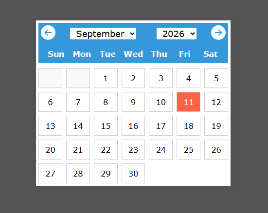

# 📅 Calendar App

A simple and responsive Calendar App built using React.

## 🚀 Features

* 📅 Displays the current month
* ⬅️ Navigate to the previous month
* ➡️ Navigate to the next month
* 🗓️ Displays days and dates
* 📱 Responsive design
* ⚛️ Built with React Hooks

## 🛠️ Technologies Used

* React
* JavaScript
* HTML
* CSS
* SVG Icons

## ⚙️ Installation

### 1. Clone the repository

```bash
git clone https://github.com/Keerthi1218/calendar-app.git
```

### 2. Open the project folder

```bash
cd calendar-app
```

### 3. Install dependencies

```bash
npm install
```

### 4. Start the application

```bash
npm start
```

The app will run at:

`http://localhost:3000`

## 📸 Project Preview

Add your screenshot below:



## 💡 How It Works

The Calendar App uses JavaScript's `Date` object to get the current month and year.

React `useState` is used to manage the selected month.

The left and right arrow buttons allow the user to navigate between previous and next months.

## 🔮 Future Improvements

* Add event creation
* Highlight today's date
* Add month and year selection
* Add dark mode
* Add reminders

## 👩‍💻 Author

**Keerthika K**

GitHub: https://github.com/Keerthi1218

LinkedIn: https://www.linkedin.com/in/keerthika1207/

---

⭐ If you like this project, please give it a star!
